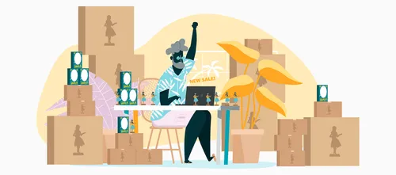

# ShopNest

ShopNest is a modern e-commerce web application built using PHP, MySQL, and Supabase. It allows administrators to manage products and users to browse, add products to their shopping cart, and make purchases.

## Features

### Admin Features
- Add new products with name, price, and image.
- Store product images securely in Supabase storage.
- Modify existing products.
- Delete products.
- View all products.

### Client Features
- Register and log in to the platform.
- Browse available products.
- Add products to the shopping cart.
- Update product quantities in the cart.
- Remove individual products or clear the entire cart.

## Installation

1. Clone the repository or download the project files.
2. Place the project folder in your web server's root directory (e.g., `htdocs` for XAMPP).
3. Import the database:
   - Open phpMyAdmin.
   - Create a new database named `ShopNest`.
   - Import the `sql/ShopNest.sql` file into the database.
4. Update the database connection:
   - Ensure the database credentials in `admins/config.php` match your local setup.
5. Configure Supabase:
   - Create a Supabase project at [Supabase](https://supabase.com/).
   - Set up a storage bucket named `shopnest`.
   - Add your Supabase URL and API key to the `config.php` file.

## Usage

### Admin
1. Navigate to `http://localhost/ShopNest/admins/index.php`.
2. Use the admin dashboard to add, modify, or delete products.

### Client
1. Navigate to `http://localhost/ShopNest/Clients/register.php` to create a new account.
2. Log in at `http://localhost/ShopNest/Clients/login.php`.
3. Browse products, add them to your cart, and manage your shopping cart.

## Screenshots

### Admin Dashboard

### Client Product Page

## Technologies Used

- **Frontend**: HTML, CSS, Bootstrap
- **Backend**: PHP, Supabase
- **Database**: MySQL

## Security Considerations

- Passwords are hashed using `md5`. Consider upgrading to a more secure hashing algorithm like `bcrypt` or `password_hash`.
- Input validation and sanitization should be improved to prevent SQL injection and XSS attacks.

## License

This project is open-source and available for personal or educational use.

## Acknowledgments

- [Bootstrap](https://getbootstrap.com/) for styling.
- [phpMyAdmin](https://www.phpmyadmin.net/) for database management.
- [Supabase](https://supabase.com/) for cloud storage and backend services.